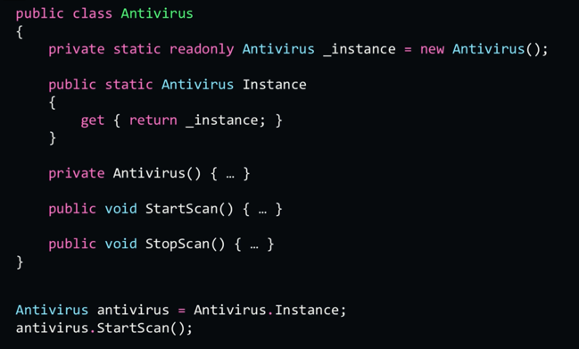

# How to Become a Senior Developer - Beyond coding skills

## 1. Introduction

### 1.1 Introduction

- How to know you really understand the task you have been given.
- How to plan a solution
- Which new technologies to learn, and how to learn them?
- Google
- Use shortcuts. Be a superuser.
- Speed up videos when you can.
- Not a technical course.

### 1.2. Who is a senior developer?
- Proficient
- Writes high-quality code
- Aware of technologies and methodologies inside and outside the company
- Manages himself
- Prioritizes & handles task
- Brings value
- Decides how to invest time in the most efficient way
- Strives for excellence
- Team player.
- Act selfless for the team benefit.

### 1.3. How is this course built?

- Introduction
- Excel. Performing a task excellently
  - Understand. 
  - Solve. Plan a solution, find what needs to be done, choose the best solution. 
  - Implementing. What is a good coding session
  - Test
  - Bugs
- Learn. Setting yourself goals,
  - Goals
  - Learning Techniques
  - Build a plan
- Take the next step
  - Time management
  - code quality
  - The zone
  - Stand out

## Excel

### 2.4 Excel: introduction

- Why is the understanding the task important? Make sure you really understand it
- What are the steps for reaching the optimal solution?
- Implementing a solution
- Testing
- Bugs

### 2.5 Excel: Understand the task

- Invest time in understanding the task before coding.
- How to tell you to understand the task?
- When did you understand the task, so you can start coding?
- How to remember what you understand? (for example, in between vacations)

Specification Document => Clear understanding of the task

- Why invest time in having a deep understanding of the task before coding?
  - Less bugs
  - Minimize changes after coding begins
  - Better time management (usually developers jump too early to code). How to tell you to understand the task?
  - When can you start? When you own all the details of the task, even those unspoken.
  - Basic understanding includes:
    - What does the user see?
    - how does each part behave?
    - What interaction is there with other components?
    - What are the edge cases, and how to handle them? Edge cases can break geniusly designed architectures.
  - Document your understanding.
  - YOu can use flow charts or diagrams.
  - Edge cases can come as a table with a solution

- Why is understanding the task important? Fewer bugs, minimize changes, better time management
- What does understanding the task mean? Clear mental image of the task, being able to explain. Answer three questions: what does the user see, how does each part behave, what interaction is there with other components?
- How to remember? Document. Use charts or diagrams.

### 2.6 Excel: Solve
- Why spend time on planning a solution?
  - To avoid reinventing the wheel.
  - Write compatibility code.
  - Not waste time on implementing suboptimal solutions
  - Not find later that the solution doesn't work.

- A good solution:
  - Includes analysis, conclusion, small steps, and a plan.
  - Includes considerations for implementing and small testing.

- What are the steps for solving a task?
  - Define the task technically.
    - Technical scope. What needs to be done?
    - Context: Parts of the system that interact with your code, code you can learn from or use.
    - Coding standards: naming, conventions, etc.
  - Finding the best optional solution: 
    - What are relevant solutions?
    - Which solution is the optimal? (Have in mind cost, performance, forward compatibility, simplicity, security, completeness, maintainability, coding standards and conventions compatibility)
  - Validate applicability
    - POC
- How to remember the solution?
  - Document. (mockup comments, key info comments, charts, diagrams, edge cases)
  - Comment the mockup
  - Use algorithms and pseudocode.

### 2.7 Excel: Implement 

- We actually write code here.
- What is considered a good coding session?
  - Concentrate solely on solving a specific issue
  - Clear image of what you are trying to accomplish
- Where to start writing code from?
  - Write the main flow. Solve the main problem first, main task. Small details later.
  - Use the documents so far + the specs
  - Working software

Be aware of all the tasks' details
Concentrate on the big picture
The main flow is where you should start.

### 2.8 Excel: Test 

- Convert Working software into flawless tests

- Why test?
  - What I did works perfectly. Signature.
- How to test?
  - QA tries to break the software. Developer tries to create.
  - Remove bias on yourself. Ask others to test. Other users, other developers.
- How Much should you test?
  - The software Craftsman: Dedicated QA teams are an antipattern. Testers should find nothing, zero, nada.
  - As much as it takes for you to be sure, there aren't any bugs.
- When to test?
  - As soon as possible.

### 2.9 Excel: Bugs

- Know your toolbox: Debugger.
- IDE. Stack trace
- Document.
  - What did you try and what results? 
  - What clues did you find?
  - What do you plan on doing next?
  - Everything else that might help.

- Solving a bug in production:
  - Take it easy
  - Gather information.
  - Double check. Understand the correct behavior.
  - Understand the related functionality.
  - Find and understand the error message.
  - See the bug for yourself.
  - Find the exact point of failure.

### 2.10 Excel - Conclusion

- Good software, or on time.
- Measure twice, cut once.

- Look for unclear issues and make them clear
- Always know where you are in the bigger picture
- Always make sure what you know is available to you

## Learn

### 3.11 Learn: Introduction

- Writes high quality
- Aware of technologies and methodologies
- Finds and solves bugs quickly

Find the most cost-effective way to learn new technologies.
Cost = time
Effective = acquiring the relevant knowledge and expertise.

### 3.12 Learn: Set yourself goals
  - Have a vision. Where do you see yourself in one, two, five years?
    - SMART goals
      - Specific.
      - Measurable.
      - Achievable.
      - Relevant.
      - Time-bound.


### 3.13 Learn: Know your resources
  - Besides the goals, we will need resources and techniques
  - Time types:
    - Free time in front of a computer
    - Time at work.
      - Learn how to work in an organization.
      - Completing tasks.
    - Free time not in front of a computer
  - Time—using it wisely
    - Consume only what is relevant, and skip everything else.
    - You will get more satisfaction.
    - Look for a positive feeling. If you don't like it, maybe look for something else.

### 3.14 Learn - Techniques I - Theory
  - Books. N1 source of truth.
    - Don't waste time on reading stuff you don't find relevant.
  - Blogs.
  - Other people's code. Third parties, teammates.
  - Listening
    - Podcasts. Riding a bike, walking, etc.
    - Trends, methodologies, concepts.
    - Enjoyable.
  - Watching
    - Online courses
    - Active learning is more efficient than passive learning.

### 3.15 Learn: Techniques II - Practice
  - Code kata.
    - Improve by repetition.
    - Explore the possibilities
  - Games and challenges
    - Coding games. Gamefying learning.
    - Code reviews
  - Hackathons
    - Learn by doing
  - Contributing to open source projects
    - Other review your code
    - Reputation
    - Satisfaction
  - Code reviews
    - Free lessons
    - Risk of too aggressive, or boring. Stack exchanges.
  - Pet Project.


### 3.16 Learn: Plan your path
  Ingredients for a plan
  - Smart goals
  - Time
  - Theoretical learning
  - Practical learning

Approaches:
  - Objectives by timeframes. Uses power of habits
  - All in. You use your whole time for something.
  - Combination of the two.

### 3.17 Learn - Conclusion

- A good learning session
  - Is of value. Biggest return for the time investment.
  - Stick with you. Avoid wasting your time.
- Where you want to be in a few years?
- What are the most relevant topics?
- Build a plan and stick to it.
- Power of habits. A person who studies for 15 minutes a day in a year, he will be an expert. In 5 years, he will be a master.

## Take the next step

### 4.18 Take the next step: Introduction
- Time management
- Code quality
  - Why is it important?
  - When to write poor code?
- Saying "no" to your manager
  - When to say no?
  - How to say no?
- The zone
- Stand out
- Conclusion

### 4.19 Take the next step: Time Management
- Independent developers are assigned a task and managed themselves.
- You cannot estimate how much it will take something you don't understand
1. estimate how long the task will take. (after understanding the task) 2. Give a rough estimate.
2. Analyze external dependencies and estimate them.
3. If there are delays, reflect them to your manager.
4. A problem reported long before the deadline is a problem. A problem reported shortly before the deadline is a crisis.
5. If managing a task is a single step, the next step is several multiple tasks. The next step is managing people.

### 4.20 Take the next step: Code quality

- Every craftsman should be proud of his craft.
- Manifesto for software craftsmanship (sign it)
- Only settle for less as a last resource.
- The price for compromising code quality for long is 
- High-quality code is an investment that will return.
- Profit is the deciding factor.

Recommending new technology:
- How long will it take to implement this technology?
- How long will it take you and other team members to learn it?
- Does this technology have known issues?
- is it stable?
- What benefits will it bring?

Summary:
- Always aspire to write as high-quality code as possible.
- The people who spend the money are the ones who should make the calls.
- Reflect the relevant information to those stakeholders.

### 4.21 Take the next step: Saying "no" to your manager

- Make sure the managers understand the deep implications of the decisions they make.
- Sometimes the person who assigns you a task doesn't understand its full implications.
- It is our duty to reflect that to our managers
- What the leader says is what counts
- Never say no. Reflect the implications of the decision, and provide the best solution it can. Let The business be right or wrong.

### 4.22 Take the next step: The zone
- The zone is a state of mind where you are fully concentrated on the task at hand.
- Detach from everything around. Prevent interruptions and focus.
- Work early / late.
- Use headphones.
- Close messaging application.
- No messages, no calls. No meetings. Get everything you need! from the code, to the coffee.
- Have clear goals.
- Devote yourself to the task.
- With all this, your productivity will increase.

### 4.23 Take the next step: Stand out
- Ask Why, Why, Why 
- Help your team achieve its goals.
- Look beyond the task, promote the team.
- Become a Guru. Share your knowledge.
- Lead
- Kaizen
  - Number of bugs per task.
  - Time estimation accuracy (here, using burning charts, WIP throughput, and cycle time might help)
  - Number of comments in code review
  - number of misunderstanding connections between subtasks

- Scale
  - Number of bugs per task or per programming hours
  - percentage of deviation from time estimation
  - number of unplanned changes to code you already wrote

- Reflect
- Awareness
  - Can be it done better?


### 4.24 Take the next step: Conclusion

- Time management
  - Can't estimate without understanding
  - Reflect any delay
- Code quality
  - Reflect the implications
  - You don't take the calls
- Saying "no" to your manager
  - Reflect the implications
- The zone
  - Remove distractions
- Stand out

### 5.25 Back to whom is a senior developer?

- Proficient
  - Writes high-quality code
  - Aware of technologies and methodologies inside and outside the company
  - Finds and solves bugs quickly.
- Manages himself
  - Prioritizes & handles tasks
- Professional
  - Brings value
  - Strives for excellence
  - Kaizen
- Team player
  - Looks beyond his tasks
  - Helps his team achieve its goals
  - selfless

### 5.26 Last lesson
- Two parameters to measure candidates:
  - Motivation.
  - The inheritance model
-  software developer is a professional. Inherits from the professional class, that must provide reasonable code, etc.
- Professional inherits from person. The same way you wouldn't want to work with a carpenter that doesn't deliver on time, the same applies here.
- Also, no one wants to work with someone who is lazy, unbearable, egocentric, etc.
Vision is not about the technologies, but from the person I will be.
- Selflessness. The ability to put your ego aside. What kind of people would we be? A good team player puts ego on the side, acts professionally and humanely, even when it is though and doing so for a long period of time.

6.1 intro
6.2 Break into smaller tasks
- Risk assessment, and how to solve it.
- POC.
- Hard code a first version
- Use other's experience.
- Consult with someone in your firm.

### 6.29 Estimate
- Consider the role of time estimations
- Take spare time for miscalculations, unexpected bugs; everything might go wrong.
- Develop trust with your manager. Usually they will think that the tasks have been overestimated.
- Logical agreement regarding how to translate hours into days.
- Urgent tasks, helping colleagues. How are they measured?
- Example round borders example in Internet Explorer 8.


Estimating: Understand the requirements.
  - Get help from your team members
  - Understand the requirements in depth. What should be performed, how can it be performed. 
  - Consider an edge case. A small edge case can change the whole picture.
  - Document assumptions.
  - Beware of "similar" tasks. They might not be similar at all.
    - There could be a gif different in the implementations.
  - Look for what is missing in the requirements.

Techniques:
  - Compare with similar tasks.
  - Break down into smaller tasks.
  - Don't forget to include all the parts outside the code. Tested, fixed, verified with QA, etc. A factor to consider.
  - See what implications these tasks have on other parts of the system.

Estimating: finalizing:
Once you have the hours, adjust for task executor variability (could be the strongest or weakest developer)
 provides a range of days instead of a single number.

### 7.31 Design patterns.

- Facade pattern:
  - A need to work with systems which are complex.
  - Object as front-facing interface masking more complex underlying or structural code. (Think of the 3 classes that need to publish to media. You can wrap those 3 classes as private properties of a wrapper, and have a method for calling each of them)

- Singleton pattern:
- .
- Typically created with a static method and a private constructor.
  - ```private static readonly Singleton _instance = new Singleton();```
  - restricts the instantiation of a class to a single instance
  - 

7.32
- Requirements are of continuous change. minimize changes by building extendable solutions.
  - Open-closed principle. Open for extensions, closed to changes.
  - 
- 

### 7.33 Building stable solutions for testing
