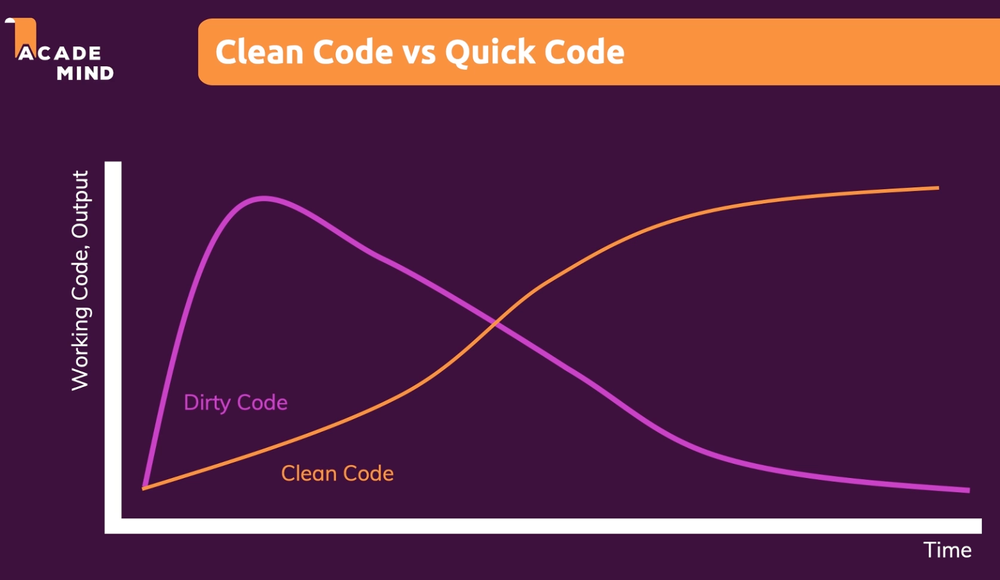
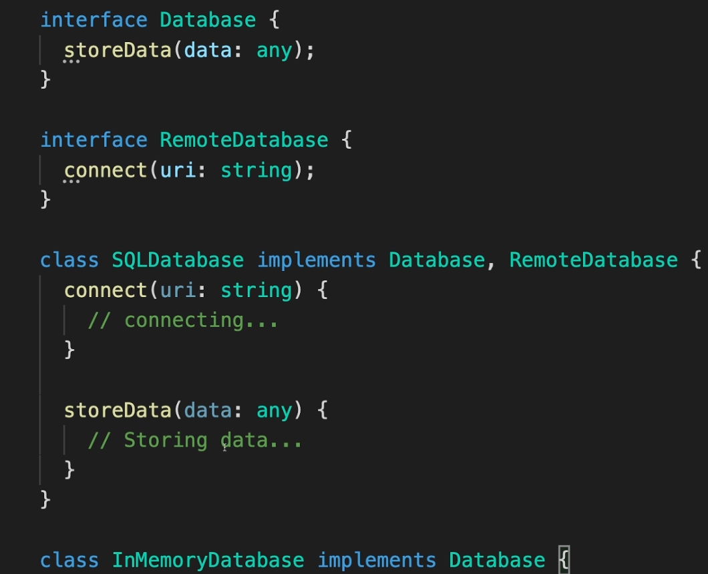

# CLEAN CODE

## 1 Getting started

### 1.1 Welcome
- Clean code has a longer chance to withstand time.
- Clean code has is easier to be maintained.

### 1.2 What is Clean code
- Bad code requires a lot of time to think it about.
- It is not about code working or not, but about if it is easy to understand.
- Reading and understading should be easy.
- Use verbs for functions and nouns for classes. Don't use abbreviates.
- There is not a single way to write clean code
- Should eb readable, meaningful, reduce cognitive loade, concise "to the point", avoid unintuitive names, complex nesting and big code blocks. Should follow common best practices and patters, should be fun to write and to mantain
- Think your code line an essay, you are the author.

### 1.3 Clean Code - key pain points an how to write clean code
- Naming.
- Code formatting, good and bad comments.
- Functions: length, number of parameters.
- Conditionals & error handling. Deep nesting or missing error handling
- Classes & data structures. Bloated classes, missing distinction.
- Solutions: Rules, concepts patterns, principles, TDD

### 1.4 How is this course structured
- Learn about bad code and why it is bad. Understand the core rules. See good code in action.
- Transform bad to good examples, then doing y=on your own.

### 1.5 Course Prerequisites
- Basic programming experience is required.
- You should be familiar with the basics of the language you are using.

### 1.6 Clean Code & Strongly typed languages
- Types primarly avoid errors.
- Types could have an extra benefit in readability, but it is not the main goal.
- Types are not a must for clean code.

### 1.7 About the course code Examples
- Examples might not execute and don't neccesarily follow a coding paradigm.

### 1.8 Join the community on Discord
- https://academind.com/community/

### 1.9 Course Functional, OOP, Procedural: The course Concepts always apply!
- The course doesn't focus on a specific paradigm
- Doesn't matter the paradigm, the points expressed on 1.2 always apply.

### 1.10 Clean Code, Principles & Patterns & Clean Code
- Wirte code which is readable and easy to understand
- Maintainable and extensible
- Clean code is not the same as Clean Architecture.
- Clean code: how to write the code. Single problems / files
- Clean Architecture: how to write which code. Focuses on the project as a whole

### 1.11 Clean Code Vs quick Code
- clean code is written over time.
- You will always find ways of improving your code.
- Your code will alongisde the project.
- Refactor is a cyclic flow.
- It is always iterative and non ending. There is always a better way to write the code.
- You save time tomorrow if you refactor today.
- A codebase can only survive and stay maintainable if it continuously improved and refactored
- Try to improve existing code along the way.

### 1.12 Module and Course Resources
- Just download them if needed.

## Naming—Assigning Names to Variables, Functions, Classes and more

### 2.13 Module Introduction

- Naming, why naming matter. Rules, concepts and bad names.
- Examples, demos, and challenges.

### 2.14 Why good names matter
- Names should be meaningful
- They should express the content without looking at the output.
- We will not always agree. But we should always try to make it as clear as possible.

### 2.15 Choosing good names

- Variables and constants. Data containers. use nouns or short phrases with adjectives.
- Functions methods: commands or calculated values. Use verbs or short phrases with adjectives. sendDate(), inputIsValid()
- Classes: use Classes to create "things". use Nouns or short phrases with nouns. User, RequestBody.

### 2.16 Casing conventions and programming languages.
- There are four main casings. snake_case, camelCase, PascalCase, kebab-case.
- PascalCase: commonly on classes.
- snake_case: variables functions methods in Python
- camelCase: variables functions methods in JavaScript, Java
- kebab-case: HTML, CSS, URLs

### 2.17 Naming Variables & properties - theory
- Value is an object
  - Describe the value
  - Provide adjective if needed
  - user, database.
- Value is number or string
  - describe the value
  - Provide adjective if needed
  - firstName, age
- Value is a boolean
  - Answer a true/false questions.
  - Provide adjective if needed  
  - isActiveUser, loggedIn
- Value is a function
  - describe the function

### 2.18 Naming Variables & properties - examples
- Don't use abbreviations. Use the full word.
- Don't be too generic, yet avoid redundancy "userData". user is enough.

### 2.19 Naming Functions & Methods - theory
- Functions perform an operation
  - Describe the operation
  - getUser, response.send()
- Function computes a boolean
  - isValid, purchase.isPaid()
  - emailIsValid(),  

### 2.20 Naming Functions & Methods - examples
- Good examples: saveUser(), user.store(), isValidInput

### 2.21 Naming Classes - theory
- Describe the object
- Classes are instantiated. Avoid redundant suffixes.

### 2.22 Naming Classes - examples
- Be specific without being redundant or too verbose.

### 2.23 Exceptions you should be aware of
- Date.now()
- date_today.strftime(...format) (python)
- JS getters in classes: get connectedClient(){}

### 2.24 Common Errors & pitfalls
- Dont include redundant information in names
- Too much information could be a problem.
- Avoid slang, unclear abbreviations & disinformation
- Unclear abbreviations
- Disinformation. "userList" for maps.
- use Distinctive names. Avoid methods that sound familiar.
- Be consistent

### 2.25 Demo Time

### 2.26 Your Challenge - problem

### 2.27 Your Challenge - solution

### 2.28 Module Resources

### 3.29 Module Introduction
- Comments & code formatting
- Comments are mostly bad
- Code formatting and language conventions

### 3.30 Bad comments
- Usually redundant
- Dividers or separators
- Non updated comments
- Commented out code.

### 3.30 Good comments
- Legal information
- Explanations that can't be expressed in naming. For example, in regex cases
- Warnings. "only works in browser environment"
- Todo notes
- Doc strings for packages
- General rule: avoid comments

### 3.32 What is "Code Formatting" really about?"
- Vertical formatting: space between lines, grouping of codes
- Horizontal formatting: indentation, space, line length
- Formatting rules are language specific.

### 3.33 Vertical Formatting

- Code should be readable like an essay—top to bottom without jumps
- separate concepts with blank lines
- Order methods to avoid jumping
- Keep related code close together

### 3.34 Formatting: Language-specific considerations
- Some languages allow hoisting and some not.

### 3.35 Horizontal Formatting
- Avoid horizontal scrolling
- Use indentation
- break long statements into multiple shorter ones

### 3.36 Your Challenge - problem

### 3.37 Your Challenge - solution

### 3.38 Module Resources

### 4.39 Module Introduction
- Having in mind the length, how to split and the different abstraction levels

### 4.40 Analyzing key function Parts
- Calling the function should be readable
- Have in mind the order and number of parameters

### 4.41 Keep the number of parameters low
- Keep a low number of parameters
- No parameters is the best number of parameters
- Up to 3 arguments is Okish.
- 4 or more are too many.

### 4.42 Refactoring function parameters - Ideas & concepts
- Use objects to pass parameters
- Use default parameters

### 4.43 When one parameter is just right
- single purpose functions

### 4.44 Two parameters & when to refactor
- If you need to use a second argument as a flag, you should refactor.
- If you need to use a second argument as a configuration, you should refactor.

### 4.45 Dealing with too many values
- Use objects to minimize parameters
- Use objects to avoid order conflicts
- Use objects when the data is at the same level
- Use objects when there is an unstructured order

### 4.46 Functions with a dynamic numver of parameters
- Use wisely

### 4.57 Be aware of "output parameters"
- Avoid mutating arguments

### 4.48 Functions should be small and do one thing.
- One thing = one level of abstraction
- High level and low level functions
- Low level relies on the low level APIs of the coding language.
- High level - you can't control the low level details.
- High level functions should call low level functions.
- High level fucntions have no room for interpreations.
- Low level functions must have the interpretation added by the reader.

### 4.49 Whe levels of abstractions matter

### 4.50 When you should split?
- Rule of thumb: extract code that works on the same functionality. .setName and .setAge could be .udpate({name, age})
- Extract code that requires more interpretation that the surrounding code.

### 4.51 Demo & challenge

### 4.52 Stay Dry - Don't repeat yourself
- Avoid repeating yourself

### 4.53. Splitting functions to stay dry
- Split functions to avoid repeating yourself.
- Avoid unexpected side effects

### DRY
- Don't repeat yourselfKeep functions pure
- Avoid unexpected side effects
- If the function has a side effect or is not pure, it should be clear in the name.

### 4.55 Understanding & avoiding unexpected side effects
- Clean up functions
- keep them pure
- extract side effects to separate functions

### 4.56 Side effects - a challenge

3.57 Why unit tests matter & help a lot!

### 4.57 - Why unit tests matter & help a lot! 
- Can you easily test your function?
- multiple smaller functions are easier to test.

### 5.59 - Control structures
- Loops, if statement
- Avoid arrow code
- Avoid deep nesting
- Working with errors
- Practical sections
### 5.60
- Positive checks over negative checks
- Factory Functions and polymorphsim
- Utilize errors

### 5.61 - Introducing "guards"
- Fail fast
- invert the check but using !isEmailValid + return
- Prefer two returns over nested if statements
- If (user.active) and then inside user.active another user.something.. just 2 early returns.
- 

### 5.62 Guard in action
- In a loop, instead of return use continue to exit the element

### 5.63
- Extract abstractions to different functions
- use positive checks
- 
### 5.64
- Extraction control structures into functions
- tend to prefer to extract the if statement check to a function

### 5.65
### 5.66
- Extracting duplicated code into functions
- The most complicated check should be the first one.

### 5.67
- Throwing errors avoid if statements
- Use factory functions to create errors
- 

### 5.68 Creating more error guards

### 5.69 Extracting validation code
- refactor to outside function

### 5.70 Error handling is one thing!
- Error handling should be done in one place.
- Don't handle errors in multiple places.
- Use factory functions to create errors.

### 5.71 Polymorphism
- Factory functions that create always the same objects, but with different inner details in their methods.
- populate a top level object with different methods.

### 5.72 Working with default parameters
- Try to get rid of the if statements by using default parameters.

### 5.73 Avoid Magic numbers and strings
- Use constants instead of magic numbers and strings.

### 5.74 Module summary
- Module sutrcture: utils, data, services, controllers, routes

### 5.75 Resources

### 6.76 - Classes and Data Structures, Module introduction
- Different between objects and data structures / containers
- SOLID, law of Demeter
- Polymorphism, encapsulation, inheritance

### 6.77 - Objects vs Data Structures
- Not the focus of OOP

### 6.78 - Object vs Data Container Structures
- non official terms.
- A real objects hide its internal properties, and exposes a public api (methods). Exposes real abstractions, hidding the internal parts
- Data continaers / data structure, almost no APIs
- OBjects have abastractions over conrections, data containers have concretions only.

### 6.79 - Why the differentiation matters

### 6.80 - Classes && Polymorphism
- Extend classes

### 6.81 - Classes should be small
- Classes should be small and do one thing, like functions
- 

### 6.82 - Understanding "Cohesion"
- All methods each use all properties
- High cohesion: all methods use all properties
- No cohesion examples: container with utility methods
- There is no hard rule to determine cohesion
- Smaller classes tend to have higher cohesion

### 6.83 - The Law of demeter and why you should "tell, not ask"
- Avoid drilling deeply into objects. For example: this.customer.lastPurchase.date
- The Principle of least knowledge: Don't depend on the internal of stranger objects.
- Code in a method should only access direct internals (properties and methods) of:
  - The object it belongs to
  - Object that are stored in properties of that object
  - Obhjectws which are received as method parameters
  - objects which are created in the method

### 6.84 - The Solid Principles

### 6.85 - The Single Responsibility Principle & why iy matters
- Ac lass shouldnt change for more than one reaseon
- What is a single responsability?

### 6.86 - The Open/Closed Principle & why it matters
- Dont duplicate variants of methods (printPDF, printHTML).
- Those should be extensions of the original class. PrintPDF extends PrinterImplementation
- Helps with DRY
- 

### 6.87 - The Liskov Substitution Principle & why it matters
- A subclass should be able to replace its parent class without affecting the behavior of the program.

### 6.88 - The Interface Segregation Principle & why it matters
- A class should not be forced to implement interfaces it doesn't use.
- Usually related to having the wrong interface, interfaces too broad 

A good solution for a DB that doesn't need to implement a connect (for example an inMemoryDB)

### 6.89 - The Dependency Inversion Principle & why it matters
- High level modules should not depend on low level modules. Both should depend on abstractions.
- Don't depend on concrete classes, depend on interfaces.
- Avoid depending on the concrete execution of an injected class (avoid for examplpe, connecting to a DB from an APP class);
- 

### 6.90 - Module Resources

